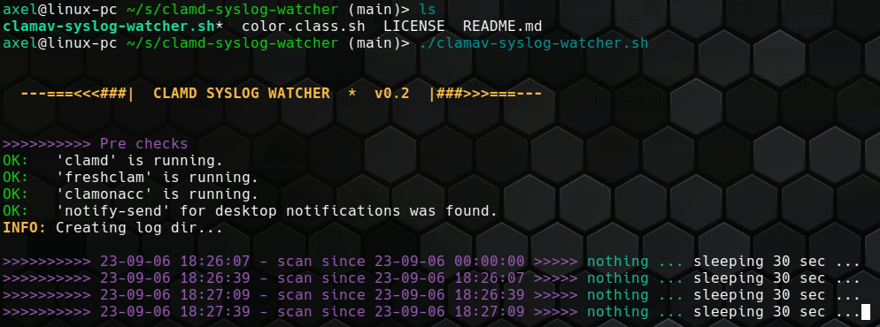
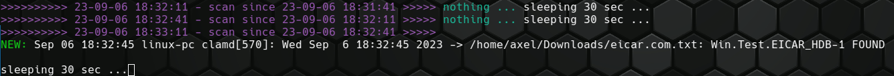
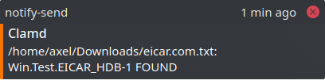

# Clamd syslog watcher #

## Description

A bash script to watch the syslog for clamav messages.
It shows FOUND infections on terminal. If the found file is new then it sends a notification to the desktop (using ``notify-send``).

👤 Author: Axel Hahn\
📄 Source: <https://github.com/axelhahn/clamd-syslog-watcher>\
📜 License: GNU GPL 3.0\
📗 Docs: TODO [www.axel-hahn.de/docs](https://www.axel-hahn.de/docs/)

## Help

```txt
./clamav-syslog-watcher.sh -h


  ---===<<<###|  CLAMD SYSLOG WATCHER  *  v0.2  |###>>>===--- 


HELP:
It is a cyclic watcher into journalctl and scans for clamd messages.
On detection it shows the log lines on termimal amd sends a list of
infected files to the desktop using 'notify-send'.

The script writes a log with mothly log files with 1st occurance
per infecte file. See subdir ./log/infections__*.txt

PARAMETERS:
    -h|--help     show this help
    -n|--nocolor  do not show colored output; NO_COLOR=1 is respected too.
    -q|--quiet    Do not show unneeded output
    -s|--sleep N  sleeptime in sec between checks; default: 30

EXITCODES:
    1 - Failed to source file 'color.class.sh'
    2 - unknown parameter was given
    3 - clamonacc not found (clamav was not installed yet)
    4 - unable to create log directory

EXAMPLES:
    clamav-syslog-watcher.sh -s 60   start scan and set scan interval to 60 sec
    clamav-syslog-watcher.sh -n -q   Show only found infections and no coloring
```

## Screenshots

After starting the syslog watcher interactively:



When I simulate a virus detection (using the eicar test file) it will be shown in the terminal. The First detection is marked with prefix "NEW". If the same file will be detected again, you get a prefix "OLD" and gray text.



Any 1st detection of a new (probaly) infected file will be shown as notification:



## Log

In the subdir "logs" a file named ``infections_[YEAR]-[MONTH].txt`` will be created.

```txt
$ cat log/infections__23-09.txt 
Sep 06 18:32:45 linux-pc clamd[570]: Wed Sep  6 18:32:45 2023 -> /home/axel/Downloads/eicar.com.txt: Win.Test.EICAR_HDB-1 FOUND
```
